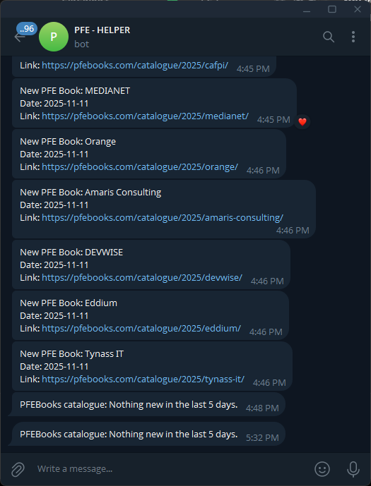
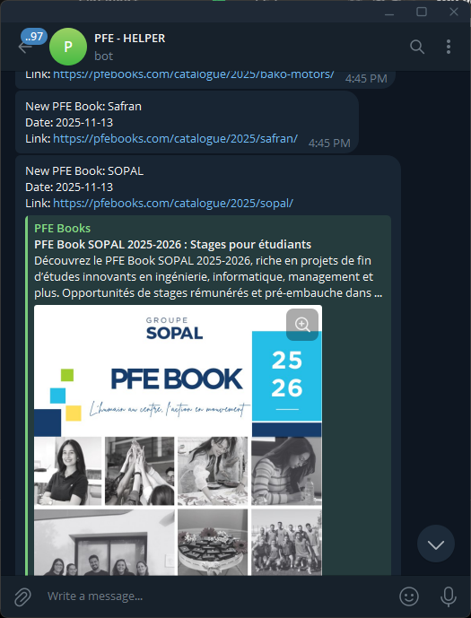

# PFE Aggregator Bot (Tunisia)

This repository contains a **Python bot that helps 3rd‑year bachelor students in Tunisia** find PFE (Projet de Fin d’Études) opportunities.

- **Main data source:** [PFEBooks.com](https://pfebooks.com/) – the catalogue of PFE Books from Tunisian and international companies.
- **Goal:** notify you when new PFE Books appear and help you organize / contact companies efficiently.

It can:

- Aggregate and normalize PFE / internship offers
- Post concise messages to a Telegram chat

> **Scope:** This bot is meant as a helper for **Tunisian 3rd‑year bachelor students** preparing their PFE. It does *not* replace your own judgment or direct contact with companies.

---

## Screenshots

Below are example screenshots showing how the bot works (you can replace file names with your own images in the `screenshots/` folder):




---

## Setup

1. **Create and activate a virtualenv**

   ```bash
   python -m venv .venv
   # Linux/macOS
   source .venv/bin/activate
   # Windows (PowerShell)
   .venv\\Scripts\\Activate.ps1
   ```

2. **Install dependencies**

   ```bash
   pip install -r requirements.txt
   ```

3. **Environment variables**

   Copy `.env.example` to `.env` and fill in values as needed:

   ```env
   TELEGRAM_BOT_TOKEN=
   TELEGRAM_CHAT_ID=

   GITHUB_TOKEN=
   GITHUB_REPO=yourusername/your-pfe-repo
   ```

4. **Input files**

- Companies CSV (master list with `Fitness Category`):
  - Preferred: `/mnt/data/PFE 2026 copy backup - pfeList.csv`
  - Fallback: `data/companies.csv`

- PFE book PDF: `/mnt/data/Opportunités stages PFE- Healio_Perspectives.pdf`
- CV PDF: `/mnt/data/Rayen Korbi.pdf` (used to auto-fill name/email/phone in templates)

The code will automatically use the `/mnt/data/...` paths when present.

---

## Core CLI

Main entrypoint:

```bash
python -m scripts.aggregator_bot [options]
```


## Pfebooks hourly notifier (GitHub Actions)

The repo includes a small script dedicated to the **pfebooks.com catalogue**:

- Script: `scripts/pfebooks_notifier.py`
- Workflow: `.github/workflows/pfebooks_notifier.yml`

What it does:

- Scrapes `https://pfebooks.com/catalogue/page/1..N`.
- Reads the publish date of each PFE Book.
- Keeps only books from the last **5 days**.
- Stores already-seen URLs in `data/pfebooks_state.json`.
- Sends **Telegram messages** for new books.
- Sends a **"Nothing new"** message if there were no new books since the last run.

The GitHub Action runs **every hour** (and can also be triggered manually), using `TELEGRAM_BOT_TOKEN` and `TELEGRAM_CHAT_ID` from your repository secrets.

---


This project is one concrete implementation focusing on **3rd‑year Tunisian bachelor students** and **pfebooks.com** as the main source, but you can easily fork it and adapt the scrapers, filters, and notifications to your own needs.